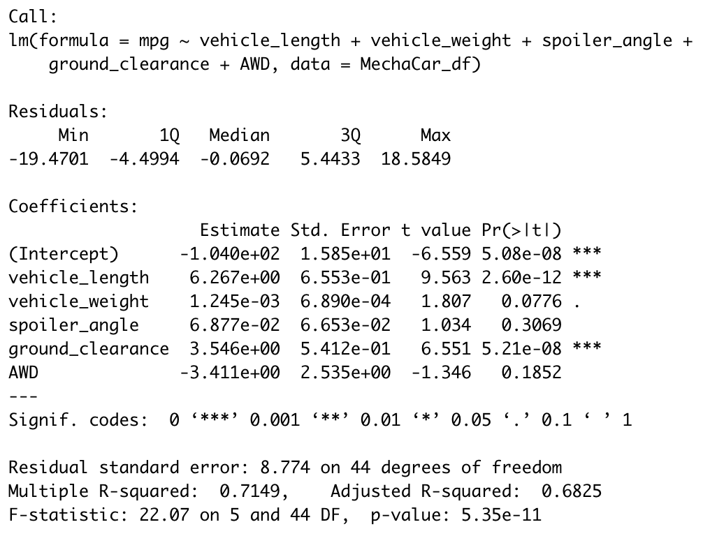
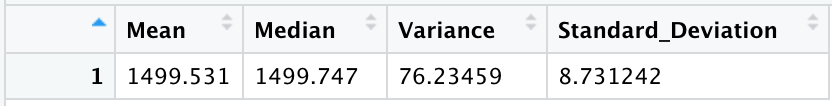
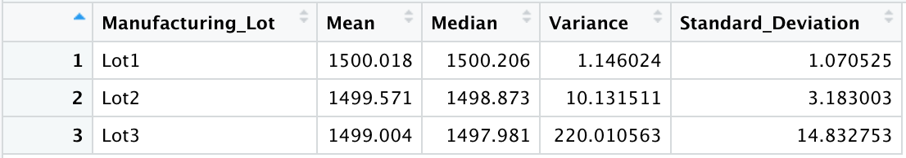
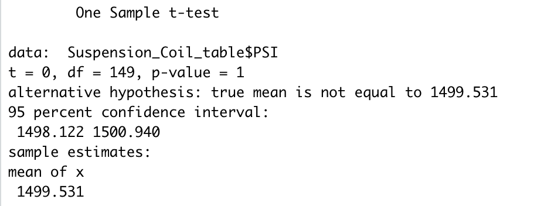
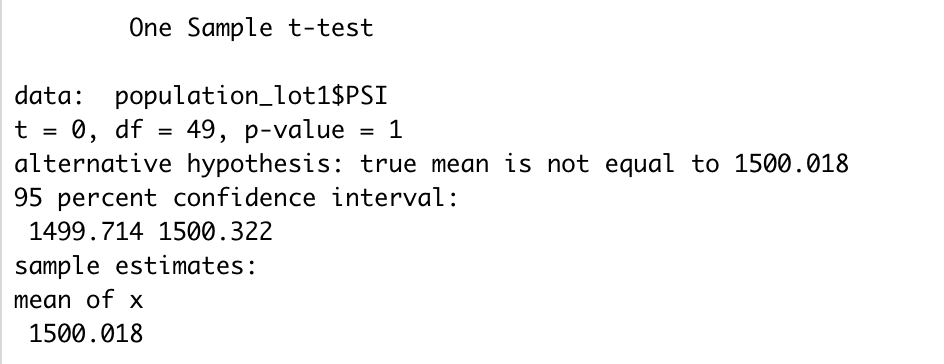
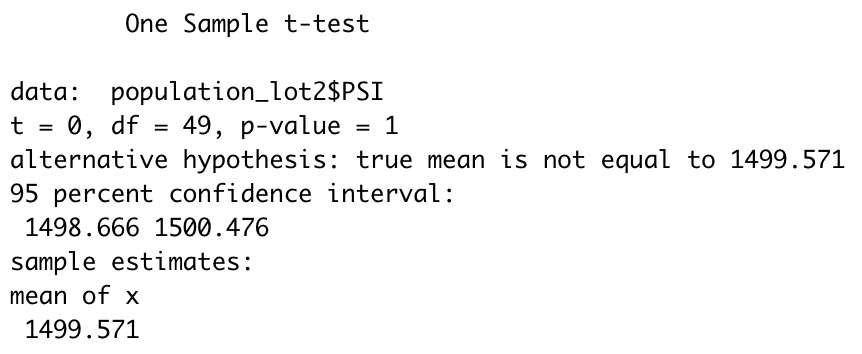
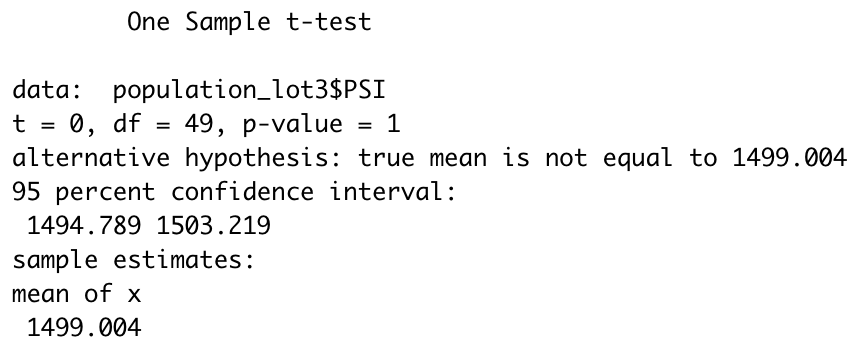

# MechaCar_Statistical_Analysis

## Background
A few weeks after starting his new role, Jeremy is approached by upper management about a special project. AutosRUs’ newest prototype, the MechaCar, is suffering from production troubles that are blocking the manufacturing team’s progress. AutosRUs’ upper management has called on Jeremy and the data analytics team to review the production data for insights that may help the manufacturing team.

In this challenge, you’ll help Jeremy and the data analytics team do the following:
- Deliverable 1: Perform multiple linear regression analysis to identify which variables in the dataset predict the mpg of MechaCar prototypes
- Deliverable 2: Collect summary statistics on the pounds per square inch (PSI) of the suspension coils from the manufacturing lots
- Deliverable 3: Run t-tests to determine if the manufacturing lots are statistically different from the mean population
- Deliverable 4: Design a statistical study to compare vehicle performance of the MechaCar vehicles against vehicles from other manufacturers. For each statistical analysis, you’ll write a summary interpretation of the findings.

## Deliverable 1: Linear Regression to Predict MPG

The linear regression results can be analyzed as follows: 
1. Vehicle length, ground clearance and intercept provide non-random amount of variance to the mpg values in the dataset. In other words, vehicle length and ground clearance have a statistically significant impact on MPG, and the intercept is statistically significant which means that there are other significant variables and factors not included in the model. 
2. There is not enough evidence to conclude that the slope of the linear model is zero because vehicle length and ground clearance are non-random and have a statistically significant impact on MPG. 
3. Since the intercept is statistically significant and there are other significant variables and factors not included in the model, this model fails to predict future mpg of MechaCar prototypes effectively. 

## Deliverable 2: Summary Statistics on Suspension Coils
The design specifications for the MechaCar suspension coils dictate that the variance of the suspension coils must not exceed 100 pounds per square inch. The current manufacturing data for Lot 3 exceeds these specifications by 120 pounds per square inch. Consequently, Lot 3 does not meet design specifications. However, all other lots and lots in aggregate do not exceed 100 pounds per square inch and meet design specificaitons. Here are the summary statistics: 

1. Total Summary 

2. Lot Summary

## Deliverable 3: T-Tests on Suspension Coils
Below you will find four one-sample t-Tests conducted to determine whether there is a statistical difference between the means of sample datasets and population datasets for All Lots, Lot1, Lot2, and Lot3. The null hypothesis for these tests assumes there is no statistical difference and the alternative hypothesis assumes there is a statistical difference. Assuming a significance level of 0.05, all the p-values seen below are above the significance level. Consequently, there is not enough evidence to reject the null hypothesis, and all means (means of All Lots, Lot1, Lot2 and Lot3) are statistically similar. 

1. T-Test All Lots

2. T-Test Lot1

3. T-Test Lot2

4. T-Test Lot3

## Deliverable 4: Study Design for MechaCar vs Competition
Next, we will conduct a study to quantify how MechaCar's newest SUV model performs against the competitor Lotuswagen's newest SUV model using the horsepower (hp) metric. Here's the study design: 

### Metric
Horsepower (hp)

### Data
To conduct the study, we will need a minimum of 50 horsepower (hp) random samples from each of the two SUVs: MechaCar and Lotuswagen. 

### Statistical Tests
The SUV with the highest horsepower (hp) sample mean will be the best performer, given that the two sample means are statistically different. Consequently, we will calculate the sample means of both SUVs to determine the highest sample mean. Then, we will run a two-sample t-Test to determine if there is a statistical difference between the two sample means. If there is a statisticall difference, the SUV with the highest sample mean will be the best performer. If there is no statistical difference, we cannot name a best performer. 

### Null and Alternative Hypotheses
The null hypothesis assumes no statistical difference between the two samples means, and the alternative hypothesis assumes a statistical difference between the two sample means. Failing to reject the null hypothesis will result in a tie, and rejecting the null hypothesis will result in a winner. 
